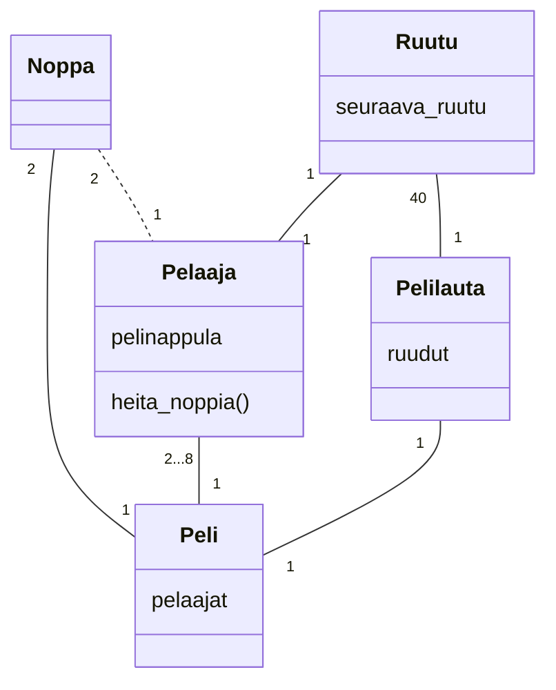

```mermaid
 classDiagram
      Noppa "2" -- "1" Peli
      Pelaaja "2...8" -- "1" Peli
      Noppa "2" .. "1" Pelaaja
      Pelilauta "1" -- "1" Peli
      Ruutu "40" -- "1" Pelilauta
      Ruutu "1" -- "1" Pelaaja
      class Peli{
          pelaajat
      }
      class Noppa
      class Pelaaja{
          pelinappula
          heita_noppia()
      }
      class Pelilauta{
          ruudut
      }
      class Ruutu{
          seuraava_ruutu
      }
```
